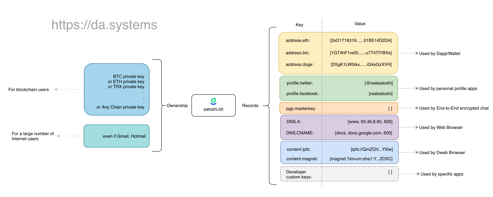

# DAS - Decentralized Account Services 

May 2021 tim@da.systems

[TOC]

> DAS to the crypto world is what Phone/Email to the internet. 

## 1. Background

With the advent of Bitcoin, humanity has for the first time truly realized the inviolability of private property. On a deeper level, it has inspired people to start re-examining and reconstructing the world in a decentralized way. Since our currency can be completely in our own hands, could our data be too? And can our identity as well? The answer is yes.

Decentralized identities are a key component of Web 3.0. There are a number of teams trying to build decentralized identities, but there are many problems with these attempts. These attempts include: 

- **Public Chain Address** 

  Somewhere along the line, a public chain address is a decentralized identity. It can be created at will, is unique, and is resistant to censorship. But it is poorly readable and difficult to use.

- **.eth, .crypto**

  Ethereum Name Service, Unstoppable Domains is a Dapp running on ethereum. Designed to map blockchain addresses, file Hash, etc. into human readable domain names. We can think of it as a more human-friendly decentralized identity than public chain addresses. However, it can only run on a specific public chain, and a BTC address cannot hold a .eth domain name. Its positioning as a domain name and inability to be used across chains makes it not an ideal decentralized identity solution.

- **W3C DID Working Group** 

  The W3C's Decentralized Identity Working Group is also actively drafting a standard for decentralized identity. Its standards are complex and have little to no product support. In a rapidly iterating field, it is difficult to develop standards and then practice them, as was historically the case with the HTML5 standard. Some products developed with reference to the W3C DID are in fact unused.

- **Handshake, Blockstack**

  Handshake is a public chain that aims to achieve decentralized top-level domain management, i.e. decentralized ICAAN. Handshake allows people to register their own domain name, which can be associated with various information, which is also a kind of identity. 

  Blockstack is a public chain, positioned as a decentralized application development platform with a built-in decentralized identity.

  The problem with such identity solutions is that they are not pure identity protocols, but a mix of other non-identity related features. It is not compatible with existing public chains, and it is difficult to spread and scale due to its complex architecture.

A decentralized identity protocol as a foundational component of Web 3.0 should be lightweight, highly compatible, composable, easy to integrate, and easy to extend.

 

## 2. DAS Overview

DAS (Decentralized Account Services) is a cross-chain decentralized identity system. Its basic units are DAS accounts. Technically, a DAS account has the following characteristics: 

1. **Easy to read and easy to spell.** For example, Alice.bit, Bob.bit. 
2. **It is created in a decentralized manner.** Anyone can create it anonymously, and once created, it cannot be destroyed.
3. **Unique.** Each account is unique, and DAS accounts with the same name cannot be created repeatedly.
4. **Cross-chain.** Based on the CKB public chain, any public chain can naturally use DAS without any modification, which is **the best feature of DAS**! *Please refer to "Appendix 1: How BTC Addresses Control Assets on CKB" for the technical principles.*
5. **Lightweight and easy to integrate.** DAS is a decentralized application, not a public chain, and includes SDKs for multiple programming languages for easy integration.
6. **Highly compatible.** Although DAS is built on CKB, users do not need to have a CKB wallet installed in advance, they do not need to have a CKB address, and they do not need to pay in CKB for using it.

A typical DAS account abstraction is as follows: 

All DAS accounts end in .bit, have a hierarchical structure, and are unique. Typical DAS accounts are alice.bit, office.bob.bit. Each DAS account contains the following underlying abstract structure: 

1. **Owner**, the ultimate owner of the DAS account, can transfer the account and set up the account's administrator.

2. **Manager**, the administrator of the DAS account, can manage the records, sub-accounts, etc. of the account.

3. **Records**, an array of parsed records for this DAS account. A parsed record is a set of key-value pairs that are defined by the user or application. Records can only be managed by the Manager, not by the Owner.

The Owner and Manager are generally presented as one or more public keys. When multiple public keys are presented, it means that the functions can be realized by multiple signatures of n/m.

## 3. User scenarios 

DAS is not a modified version of ENS, although it has similarities to ENS in terms of account abstraction; DAS aims to be a cross-chain decentralized identity protocol, not just a domain name system. In DAS's view, a domain name is just a special kind of identity, and the identity protocol itself has much larger applications than the domain name protocol. Not everyone needs a domain name, but everyone needs at least one decentralized identity.

Here are some examples of DAS usage scenarios. It is important to note that once we have a stable and reliable cross-chain decentralized identity protocol, there are many more scenarios that can be derived from it than the ones listed below.

### DAS account as a unified digital currency collection account 

Suppose Alice.bit is parsed as shown in the previous figure. A user wants to send bitcoins to alice. In a DAS-enabled wallet, the user simply fills in `alice.bit` in the receipt address and the wallet automatically resolves the BTC address to `17A16QmavnUfCW11DAApiJxp7ARnxN5pGX`. If you are ready to send Ether, the wallet will automatically resolve its ETH address as `0x829bd824b016326a401d083b33d092293333a830` . It eliminates the need for users to copy and paste alice's payment address. When Alice needs to receive payment, there is no need to provide a specific payment address, just tell the person that her DAS account is `alice.bit`.

Similarly, when a user transfers funds via a DAS-enabled wallet, the wallet will automatically display the recipient address if it has a matching DAS account. This gives the user a mechanism to double check the recipient address. It can effectively avoid transferring funds to the wrong person.

### Cross-chain Reputation Aggregation

More and more applications are focusing on the on-chain reputation of users. This means that a quantitative assessment of a user's reputation is made based on the past behavior of the user's address to determine what level of service to provide. In a multi-chain landscape, a user may have a very high reputation score on public chain A, while he is a new user on public chain B. Then, as an application on B public chain, it naturally wants to obtain the reputation of the user on A public chain in order to provide services that match it.

DAS, as a cross-chain identity system, can naturally aggregate the reputation of users on each chain. For the application, what it can obtain is no longer the reputation of a user's certain address, but the aggregated reputation of all addresses of the user on all public chains.

### The DAS account serves as the entry point to the Dapp 

Dapp generally uses contract Hash as the contract entry point, which is very unrecognizable. By adding a parsed record to the DAS ledger, we can provide a very recognizable entry point to the Dapp. For example, when we want to access uniswap's contract, we can access it from the wallet via uniswap.bit instead of its contract address.

Another benefit is that no matter how the contract is upgraded, or how the contract address changes, the user will always only need to access uniswap.bit to use the latest version of the contract.

### The DAS account serves as a portal to your personal mobile phone or business website 

In fact, the data associated with a DAS account is not limited to blockchain addresses or file hashes; it can be any data that is specified by the user. Based on this, users can selectively associate social accounts, personal profiles, personal preferences, etc. to the DAS account. Businesses can also associate their web pages deployed on decentralized storage to DAS accounts. Users can access this information when they access these accounts through a web browser with the DAS plug-in installed.

At this point the DAS ledger behaves like a domain, and decentralized, censorship-resistant domain.

### A better end-to-end encrypted communication system than WhatsApp

Since every DAS account is associated with at least one pair of public and private keys, this naturally forms the basis for sending end-to-end encrypted messages.

Take the example of Alice.bit sending a message to Bob.bit: 

1. Alice enters the content of the message in the app and fills in Bob.bit in the recipient.
2. The App obtains the public key of Bob.bit through the DAS parsing service, encrypts the message content with the public key, signs the message with the private key of Alice.bit, and then sends the message.
3. After Bob's app receives the message, it uses Bob's private key to decrypt the message and obtains the public key of Alice.bit through the DAS parsing service to verify that the message was sent by Alice.
4. Alice and Bob complete an end-to-end encrypted message sending and receiving.

This end-to-end encrypted communication system is superior to products like Facebook's WhatsApp and Apple's iMessage. Here's why: 

1. In addition to the end-to-end encryption of the message itself, the DAS account is decentralized and no one can block the account. 
2. The DAS account itself can be registered anonymously, whereas WhatsApp and iMessage require at least an email or mobile number to register.

### DAS accounts as passwordless login credentials

Services in the Web 2.0 era require account passwords for login. There are security issues with multiple sites using the same password, while multiple sites using different passwords has a high management cost.

Since each DAS account is associated with at least one pair of public and private keys, and the W3C WebAuthn standard is supported by major browsers, DAS accounts can naturally be used as credentials to log in to third-party systems. Instead of entering the account password, the login method uses the private key associated with the DAS account to sign the login operation. This eliminates the cost of password management and simplifies the login process.

### DAS as a practical status symbol 

If Alice is the top VIP client of Coinbase, and Coinbase as the holder of coinbase.bit, can create a secondary account alice.coinbase.bit and use all of alice's top-up addresses on Coinbase as the resolution record for that secondary account. Then: 

1. For Alice, this is the official recognition of her VIP status from Coinbase, a status symbol.

2. When Alice needs to transfer funds to her Coinbase account, instead of logging in to Coinbase to get the address, she can enter “alice.coinbase.bit” directly in her wallet.

In fact, any business/institution that conducts digital currency business can apply this useful identity symbol to its customers.

## 4. Basic Functions

For users, DAS provides a collection of functions.

1. **How to Get a DAS account** 

   There are two ways to get the DAS account: 

   - Register/bid with the DAS system 
   - Buy/bid in the secondary market 

   Anyone can register/bid a DAS account with the DAS system. In order to ensure the fairness of the process, the registration fee, opening time and bidding time for DAS accounts of different characters and length vary. At the same time, the DAS system will reserve the DAS accounts of well-known brands and top-ranked domain names in terms of global traffic, and subsequent entities will need to acquire them by application.

   Buying/bidding in the secondary market is also one of the ways to acquire DAS accounts, which are a scarce resource as a globally unique symbol. The DAS system has a built-in secondary trading market module to reduce the mismatch of this scarce resource.

2. **Usage and Managing your DAS account**

   After acquiring a DAS account, the user can modify its Owner, Manager, Records, and other properties of the account. The user can also decide whether to enable the sub-accounts of the account.

All of the above features are available to users on the DAS website and in any Dapp-enabled wallet.

 

## 5. DAS core components 

DAS provides a complete tool stack in an **open source** way for each part of the ecosystem to use. Including: 

1. **Core protocol** 

   Refers to a series of Lock Script & Type Script deployed on CKB, which define the DAS accounts and the related operations of the DAS accounts and are the core modules of DAS.

2. **Keeper**

   It is responsible for verifying whether a DAS account has been registered, reclaiming expired accounts, etc.

3. **Resolution Service**

    The transactions on CKB resolve the global status of DAS and provide account resolution query service to the public in the form of interface.

4. **Client SDK** 

   SDKs in various languages are included for integration into mobile wallets, web-based wallets and server wallets. With the Client SDK, developers can easily provide DAS services to users.

5. **Dapp UI**

   Users ultimately use the features of DAS through a variety of application interfaces. These applications can be used directly in the browser or can be integrated into popular in the wallet software.

6. **Payment gateway**

   When using DAS, there are fees associated with certain operations. Fees are priced in fiat currency, and thanks to the now mature price prediction machine service and the Open Transaction feature of CKB, users can pay in major digital currencies. Therefore, although DAS is a CKB-based service, there is no need to hold a CKB to use the DAS service.

7. **Governance System**

   The goal of DAS is to be a community-driven project. The community can complete governance of DAS through this system, including new feature additions, system parameter adjustment, etc.

The DAS team will implement all the above components and open source them. The Keeper, Resolution Service, Client SDK, Dapp UI, Payment Gateway and other components are available for anyone to implement their own versions according to the protocols of the Core Protocol. We are also happy to help the community implement their own versions.

## 6. Key Technology Implementation

This section briefly describes the key technical features of the DAS system, the technical challenges, and the rationale for implementing some of the features. For ease of differentiation, in the following sections the Nervos CKB blockchain is referred to as CKB, and the primary currency on this blockchain is referred to as CKBytes. 

### Any public chain address can hold a DAS account

Thanks to the custom cryptographic primitives feature of CKB, CKB can support placing the signature algorithm of any public chain on the CKB and using it for verification when necessary. For example, we can verify on the CKB that a user has provided a valid ETH private key signature for a piece of data. Further, if the ETH private key signature is verified to be valid, the state of the CKB can be modified. This is the principle of sending and receiving CKBs with ETH addresses, as implemented in the CKB.pw product. Based on this, we can extend it to manage any asset issued on CKB with any public chain address, including naturally NFT assets like the DAS accounts. This is a reflection of the high compatibility of DAS as a cross-chain decentralized identity protocol.

*Please refer to "Appendix 1: How BTC Addresses Control Assets on CKB" for technical principles*

### DAS System Design Challenges in the Cell Model 

CKB's Cell model is a generalization of the Bitcoin UTXO model, which differs from the ETH account model, where all user data for a contract is stored centrally in the internal data table of the smart contract. In the Cell model, the user data for a contract is stored in the user's own cell. Both models have their advantages and disadvantages, so we will not expand on them here. In the DAS system alone, the decentralized storage of data poses a challenge in verifying whether an account has been registered. However, this is not a problem and can be solved well by proper design.

On the other hand, we put the user's account and the descriptive information related to the account, and parse the data into the user's own Cell, which can only be modified by the user. This is more in line with the doctrine of decentralization.

### How to guarantee the uniqueness of DAS accounts

We use a logically ordered chain to ensure that a DAS account is not repeatedly registered. Each registered DAS account has a cell to store its related information, called `AccountCell`. We require all `AccountCell` to be sorted in some order, e.g., by account name in dictionary order. When a new DAS account is registered, we can ensure that the corresponding `AccountCell` must be inserted into the appropriate position in the chain through a chain script to ensure that this order is not broken. By ensuring the orderliness of the contents in the ordered chain, we can also guarantee the uniqueness of its chain elements by the way.

### Secondary market realization in the chain 

As an example, the seller issues a transaction and enters an `AccountCell` containing the account to be sold. It also outputs a `ForSaleCell` with the account, seller, and pricing information. The Type Script of the `ForSaleCell` contains the following checksum logic:

- Anyone can construct a transaction to spend the `ForSaleCell` and create an `AccountCell` for themselves. The prerequisite is that one of the outputs of the transaction needs to transfer no less than a specified number of CKBs to the seller.
- The seller can spend the `ForSaleCell` at any time and create an `AccountCell` to cancel the sale and get the account back.

### User can pay in any currency

All fee-based operations within the DAS system are priced in US dollars and paid in CKBytes. One of the key goals of DAS is to allow users to use the CKB-based DAS system without having to own a CKB. Thanks to the OTX feature of CKB, users can pay fees in other currencies to the DAS payment service provider, which builds the final transaction for the user, pays CKBytes, and uploads it to the chain.

### DAS accounts as NFT 

The data structure design and script implementation of the DAS account follows the NFT standard over CKB. This means that the DAS account can be treated as a normal NFT asset. Any application that manages and operates NFT assets can operate a DAS account. For example, third-party auction marketplaces, lending marketplaces that accept DAS accounts as collateral assets, synthetic asset platforms, etc. This also makes DAS as a decentralized identity protocol, combinable and scalable.

## 7. Ecological incentives 

The widespread use of DAS is dependent on active promotion by enthusiasts and integration by channels such as wallets. Although channel integration is designed to be a low effort in DAS, we have designed a set of incentive rules to encourage more channels to integrate DAS. 

As shown above, DAS has a built-in cash reward mechanism for channels and invitees.

If an account is priced at `X`, a user initiating a CKB transaction directly will need to pay the equivalent of ​`X` in CKBytes or other tokens to register. And you only need to pay `0.95X` for the wallet channel registration, and `0.95X` for the invitee information when you register. `0.95X` paid by the user, of which `0.1 * 0.95X` is paid to the channel, `0.1 * 0.95X` is paid to the invitee, and finally `0.8 * 0.95X` is injected into the revenue as a DAS system.

In the future, when DAS turns on decentralized governance, initiating governance proposals, voting on governance proposals, etc., will also be incentivized accordingly.

## 8. Vision

DAS to the crypto world is what Phone/Email to the internet. 

## 9. Roadmap

- Q4 2020, feasibility study - completed.
- Q2 2021, complete development of core components, including Core Protocol, Keeper, Resolution Service, Client SDK and Dapp UI, etc.
- Q3 2021, go live; open account registration and auction; start application integration.
- Q4 2021, on-chain secondary market; open source code.
- 2022, drive large-scale integration of applications.
- After 2022, launch the Governance System.

 

---

# Appendix 1: How BTC addresses control assets on the CKB

### First, this is not "cross-chain" 

At least not in the usual sense of cross-chain logic. In fact, assets on CKB do not appear on BTC, and assets on BTC do not appear on CKB; CKB is simply compatible with any public chain's ledger (address) system.

### Non-technical understanding 

Let's make some analogies, comparing a public chain to a country, and the address of the public chain is compared to the resident ID of the country. For example: 

1. ETH public chain --> USA
2. ETH address--> US ID 
3. BTC public chain--> UK 
4. BTC Address --> UK ID 
5. CKB Public Chain --> Country C
6. CKB Address --> Country C ID

In the case of the U.S., the resident must have a U.S. ID in order to hold and manage assets in the U.S., as well as in the U.K. The two countries do not recognize each other's ID cards.

However, in the case of the new country C, not only residents of country C can hold assets in their country. Residents of other countries can also hold assets in Country C if they provide a valid resident card from another country.

By further analogy, a BTC user sending assets issued on the CKB in a BTC wallet is like a US resident reselling his home in country C with a valid US ID. The resale process is officially recognized by the CKB node.

### Technical Understanding

CKB is compatible with BTC's ledger system, which essentially means that **the CKB chain can verify the signature of a CKB transaction with a BTC private key**.

 In general: 

1. The BTC verify the signature of the BTC transaction with the BTC private key, and the same applies to ETH. When the signature verification is passed and the transaction is on the chain, it means that you control your BTC assets with your BTC private key.
2. At the same time, the signature algorithm of the BTC/ETH chain is fixed, and the program logic for checking the signature is also fixed. To add a new signature algorithm, the whole chain must be hard forked.

But CKB has some new features: 

1. When adding a new signature algorithm to the CKB chain, the CKB is not hard forked and the new signature algorithm is installed on the CKB like a plug-in. 
2. Also, anyone, at any time, can deploy any signature algorithm on the CKB.

3. In a CKB transaction, it is possible to specify which signature algorithm needs to be used.

4. When a CKB node packages a transaction, it runs that particular signature algorithm to verify the transaction. When the checksum passes, the transaction is uploaded to the chain.

Therefore: 

We can install the BTC signature algorithm on the CKB and make it clear in the transaction (which is generally a transfer of homogeneous or non-homogeneous tokens) that the node must call the BTC signature algorithm for verification when packaging the transaction. When the signature verification is passed, the transaction is uploaded to the chain and the asset transfer is completed, meaning that you control your CKB assets with your BTC private key.

Similarly, we can install the signature algorithm of any public chain on the CKB. Eventually, any public chain address can hold assets issued on the CKB.

---

Thanks for reading.

 

