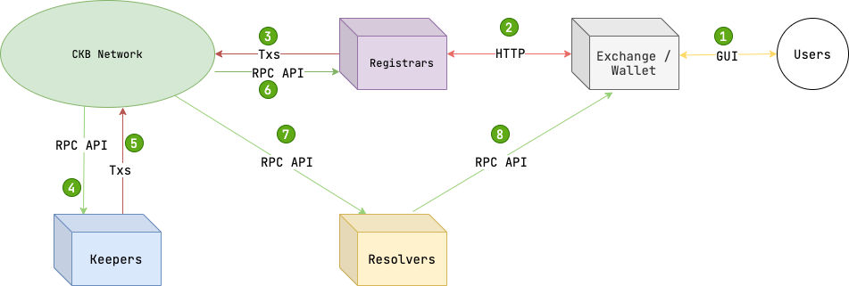
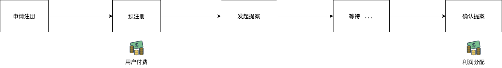
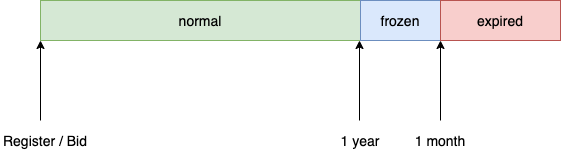

# DAS 系统设计

[TOC]

此文档为 DAS 系统的概览说明文档，主要目的是为了说明系统的整体运作方式，以及各个模块之间的交互方式、顺序。

## Big Picture

整个 DAS 都是围绕 CKB 这条链运行的，但首先我们从一个更容易理解的，用户注册使用账户的场景来了解 DAS 的运行全局情况：

1. 用户首先需要通过交易所、钱包中的浏览器访问 DAS 的注册服务；
2. 注册服务(**Registrar**)可以是由任何人实现的为用户提供 DAS 注册功能的 web 服务，当然不仅限于 web 服务，任何可以帮助用户完成链上交互并获得账户的应用都可以称为注册服务；
3. 注册服务将用户的注册请求以及其他各种操作转换成交易，通过钱包让用户签名后上链；
4. 守护服务(**Keeper**)是去中心化的 DAS 节点，随时通过节点 RPC 监控链上交易；
5. 当发现需要处理的用户交易时，就按照[交易结构协议](数据结构/交易结构协议.md)创建特定的交易完成诸如账户注册等工作；
6. 如果注册服务做的比较完善，可以通过节点的 RPC 监控用户的账户注册等状态，并在成功后及时的反馈用户；
7. 当用户注册成功账户，并设置玩解析记录后，解析服务(**Resolver**)就可以通过节点 RPC 解析链上区块获取数据；
8. 最后，解析服务通过自己的 RPC 接口将数据提供给钱包、交易所等需要使用解析记录的应用完成对用户账户的利用；

## 账户唯一性和注册流程

理解 DAS 账户唯一性的关键就在于理解 DAS 账户的注册流程，所以这里对注册流程做一个简单的概览，如下图所示：

- 首先用户需要申请注册，这一步用户的账户名是被 hash 的保密状态，这里的设计及其原理详见[防抢注机制](防抢注机制/防抢注机制.md)；
- 等待一段时间后用户可以发起预注册，提供需要注册的账户名明文以及注册费；
- 接下来守护服务通过监听链上的预注册交易发起提案，提案的内容就是那些账户将注册成新账户；
- 最后等待一段时间后，守护服务就可以确认提案，完成新账户的注册，这里的设计及其原理详见[账户链机制](账户链机制/账户链机制.md)；

上面每一步，除了“等待”以外每一步对应一笔交易，如果期望深入理解详见[数据结构/交易结构协议](数据结构/交易结构协议.md)。

## 链上账户结构

当账户注册成功后，就是对账户本身的使用了，使用账户的方式可以分为两类：一类是通过交易修改账户的写入操作，另一类是通过解析 cell 数据读取账户信息的读取操作。

对于写入类操作，除了了解账户的结构意外还必须了解各种账户相关的交易，比如：

- [账户转让](数据结构/交易结构协议.md)；
- [修改管理员](数据结构/交易结构协议.md)；
- [修改记录](数据结构/交易结构协议.md)；
- [账户续期](数据结构/交易结构协议.md)；

对于读取类操作，只需要了解账户的结构即可，关于账户的具体数据结构详见[Cell 结构协议](数据结构/Cell%20结构协议.md) 。

### 账户生命周期

在操作账户时，千万要注意的一个因素是**账户的生命周期**：

对应上图中生命周期的每个状态分别是：

- **正常状态**，这种就是用户注册好账户后，正常缴交账户年费时的状态；
- **冻结状态**，当账户超过了续费的时间点之后，账户就会进入冻结状态，此时账户结构依然完整，无法再进行任何写入操作，读取操作因为是在链下实现，所以合约无法限制，但是**建议针对此种状态的账户给出明确的警告和提示**；
- **逾期状态**，当账户超过冻结期限还未续费，账户就会进入逾期状态，此时守护服务可以对账户进行回收，并将其中的 CKBytes 作为自己的奖励，**账户被回收后就不再存在于链上了**；

由于 CKB 链的特性，账户对过期时间的判断是依赖于被称为 TimeCell 的一个特殊 cell ，由 Nervos 团队开发了其合约脚本并且现[已开源](https://github.com/nervina-labs/ckb-time-scripts)，**注意 TimeCell 和现实时间是有误差的，只是它已经足以作为链上时间的参考值了。**

### 解析记录

解析记录是每个账户最最重要的数据，单个账户的解析记录并没有明确的条数限制，但由于合约执行开销的问题，所以总的解析记录体积被限制在了一个合理的范围内。每条解析记录都包含以下字段：

- `type` 字段为记录类型，目前必须是 `address, profile, custom_keys` 当中的一个；
- `key` 字段为记录的 key ，根据不同的类型有不同的 key 可以使用；
- `label` 字段为用户对记录的自定义命名；
- `value` 字段为记录的具体值；
- `ttl` 字段为记录的有效期，各级缓存应该在此有效期后及时更新缓存；
