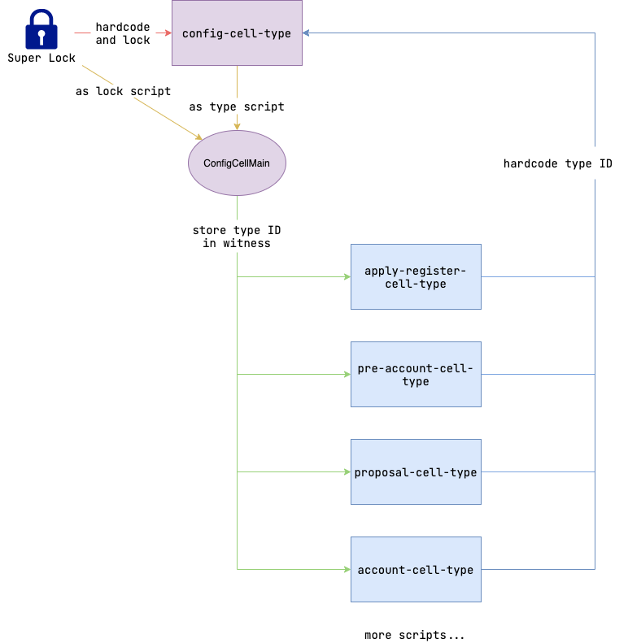

# 脚本与 cell 防伪造

因为 DAS 的很多交易存在多合约脚本的协作，以及多 cell 的协作，本文档描述了在这些协作中 DAS 如何解决以下两个问题：

- 如何防止攻击者使用其他合约脚本充当 DAS 的合约脚本；
- 如何防止攻击者伪造 cell 充当受 DAS 合约控制的 cell；

## 原理

在 CKB 这条链上存在几个规则可以帮助我们解决这一问题：

- 执行时实际调用的合约脚本是通过 `cell.lock.code_hash` 或 `cell.type.code_hash` 确定的；
- `code_hash` 其实就是脚本编译后的可执行文件的 blake2b hash 值或者一个类似的具有唯一性的 type ID 值，因此 `code_hash` 一致时才可以认为是同一个脚本；
- `cell.type.code_hash` 所指向的脚本，会在 cell 作为 input、output 时都被执行；

> 关于 type ID 及其原理详见 [RFC-0022](https://github.com/nervosnetwork/rfcs/blob/f0bf9fd6c6/rfcs/0022-transaction-structure/0022-transaction-structure.md#type-id) 。

## 方案

根据以上原理我们设计出了以下方案：

 

如图所示描述了以下几个规则：

- 首先 DAS 系统会确定一个基于多签的 **super lock**；
- 然后它将被硬编码到 **config-cell-type** 脚本的源码中，限制对 **config-cell-type** 创建和修改；
- **config-cell-type** 在部署上链后，会以它的 type ID 为 `type.code_hash` 创建 **ConfigCell** ，该 cell 会在 witness 字段存放各个其他 types script 的 type ID；
- 而各个其他 cell 需要在脚本内硬编码 **config-cell-type** 的 type ID；

接下来就根据这几条规则我们来看看它们如何解决了我们的问题。

### 脚本防伪造

因为 **ConfigCell** 的 witness 中记录了各个 type script 的 type ID ，所以在 type script 之间互相配合时，或者任何其他地方需要依赖 type script 做判断时，只需要读取并解析 **ConfigCell** 的 witness 中的 type ID 即可安全的确认其他脚本也被包含在交易中。

而 **ConfigCell** 本身的 `type.code_hash` ，也就是 **config-cell-type** 的 type ID ，是硬编码在各个 type script 中的，所以不存在被冒充的可能，它自身也使用了 **super lock** 因此无法被他人随意的创建、修改。

### Cell 防伪造

因为如上所述 type script 的 type ID 无法被伪造，所以确认 cell 没有被伪造就很简单了，DAS 的所有交易在执行中只会严格按照 **ConfigCell** 存放的 type ID 去读取交易中的 cell ，如果 type ID 不同那么 cell 的数据甚至不会被读取。

